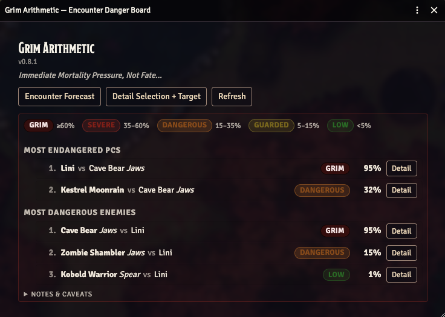
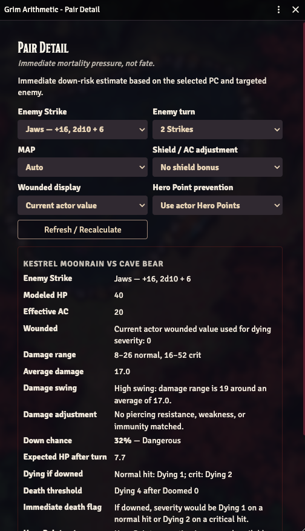
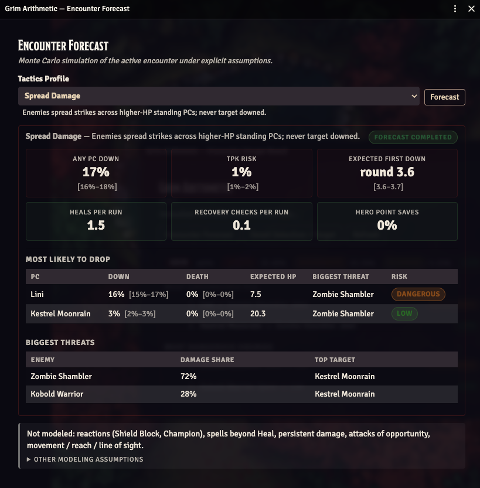

# Grim Arithmetic

[](https://github.com/kyletravis/grim-arithmetic/releases/latest)
[](https://github.com/kyletravis/grim-arithmetic/releases/latest)
[](https://foundryvtt.com/packages/grim-arithmetic)
[](https://github.com/kyletravis/grim-arithmetic/blob/main/LICENSE)

*Foundry knows how hard the encounter is. Grim Arithmetic tells you who might not walk away.*

A GM-only Foundry VTT module for **Pathfinder 2e** that surfaces real, immediate down-risk for every PC vs every enemy in the current scene — using exact dice distributions, not vibes.

<table>
  <thead>
    <tr>
      <th>Encounter Danger Board</th>
      <th>Pair Detail</th>
      <th>Forecast Panel</th>
    </tr>
  </thead>
  <tbody>
    <tr>
      <td><a href="resources/ga09.png"></a></td>
      <td><a href="resources/ga10.png"></a></td>
      <td><a href="resources/ga11.png"></a></td>
    </tr>
  </tbody>
</table>

## What it does

- **Encounter Danger Board** — a sortable table of the most endangered PCs and the most dangerous enemies, with per-pair down chance and a one-click drilldown.
- **Pair Detail panel** — exact dice-distribution math for a chosen PC vs enemy Strike: damage range, average, swinginess, down chance, dying severity, doomed-adjusted death threshold, and Hero Point notes.
- **PF2e-aware extraction** — pulls Strikes, AC, HP, wounded, and doomed straight from the actor.
- **Honest about scope** — explicitly flags what is and isn't modeled (no permanent-death probability, no reactions, no persistent damage — yet).

## Install

**Option 1 — Foundry package directory (easiest):**
Search for **Grim Arithmetic** in Foundry's **Add-on Modules → Install Module** browser, or visit the [listing on foundryvtt.com](https://foundryvtt.com/packages/grim-arithmetic) and click *Install*.

**Option 2 — Manifest URL:**
In Foundry, go to **Add-on Modules → Install Module → Manifest URL** and paste:

```
https://github.com/kyletravis/grim-arithmetic/releases/latest/download/module.json
```

For a specific pinned version, grab the version-specific `module.json` URL from that [GitHub Release](https://github.com/kyletravis/grim-arithmetic/releases).

After installing, enable **Grim Arithmetic** inside your PF2e world via **Game Settings → Manage Modules**.

## How to use

1. Open a PF2e scene with at least one PC token and one hostile NPC token.
2. Open the **Token Controls** toolbar and click the **skull icon**.
3. The **Encounter Danger Board** opens, ranking the riskiest PC/enemy pairings in the scene.
4. Click **Detail** on any row to open the **Pair Detail** panel for that matchup.
5. In Pair Detail, you can switch the enemy Strike, change MAP, toggle Hero Point assumptions, and pick which wounded value drives the math.

The board and detail panel are GM-only and never broadcast to players.

## Compatibility

| | |
|---|---|
| Foundry VTT | Built for **v14** (verified on v14.364); **v13** supported for backwards compatibility |
| System | Pathfinder 2e (`pf2e`) |
| Current version | see [latest release](https://github.com/kyletravis/grim-arithmetic/releases/latest) |

Starfinder 2e support is on the roadmap.

## Disclaimer

Grim Arithmetic is an independent module and is not affiliated with, endorsed by, or sponsored by Foundry Gaming LLC, Paizo Inc., or the Pathfinder/Starfinder brands.

## Development

```bash
npm install
npm run check     # eslint + vitest + vite build
npm run package   # build the release zip
```

## Author

Kyle Travis — [kyletravis.com](https://kyletravis.com) · [@kyletravis](https://x.com/kyletravis)
