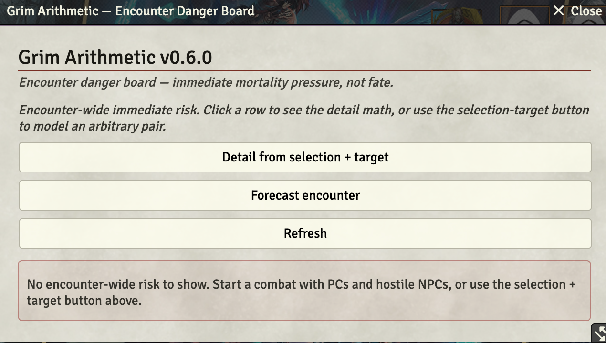
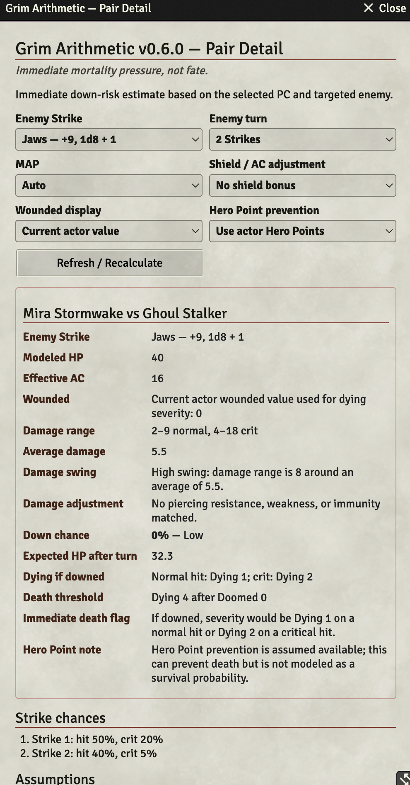
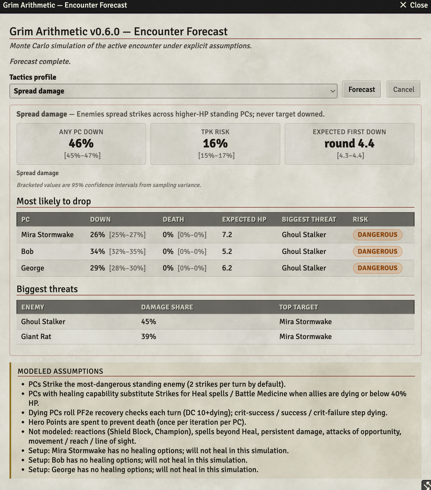

# Grim Arithmetic

*Foundry knows how hard the encounter is. Grim Arithmetic tells you who might not walk away.*

A GM-only Foundry VTT module for **Pathfinder 2e** that surfaces real, immediate down-risk for every PC vs every enemy in the current scene — using exact dice distributions, not vibes.

<table>
  <thead>
    <tr>
      <th>Encounter Danger Board</th>
      <th>Pair Detail</th>
      <th>Forecast Panel</th>
    </tr>
  </thead>
  <tbody>
    <tr>
      <td><a href="resources/ga03.png"></a></td>
      <td><a href="resources/ga04.png"></a></td>
      <td><a href="resources/ga05.png"></a></td>
    </tr>
  </tbody>
</table>

## What it does

- **Encounter Danger Board** — a sortable table of the most endangered PCs and the most dangerous enemies, with per-pair down chance and a one-click drilldown.
- **Pair Detail panel** — exact dice-distribution math for a chosen PC vs enemy Strike: damage range, average, swinginess, down chance, dying severity, doomed-adjusted death threshold, and Hero Point notes.
- **PF2e-aware extraction** — pulls Strikes, AC, HP, wounded, and doomed straight from the actor.
- **Honest about scope** — explicitly flags what is and isn't modeled (no permanent-death probability, no reactions, no persistent damage — yet).

## Install

**Option 1 — Foundry package directory (easiest):**
Search for **Grim Arithmetic** in Foundry's **Add-on Modules → Install Module** browser, or visit the [listing on foundryvtt.com](https://foundryvtt.com/packages/grim-arithmetic) and click *Install*.

**Option 2 — Manifest URL:**
In Foundry, go to **Add-on Modules → Install Module → Manifest URL** and paste:

```
https://github.com/kyletravis/grim-arithmetic/releases/latest/download/module.json
```

For a specific pinned version, grab the version-specific `module.json` URL from that [GitHub Release](https://github.com/kyletravis/grim-arithmetic/releases).

After installing, enable **Grim Arithmetic** inside your PF2e world via **Game Settings → Manage Modules**.

## How to use

1. Open a PF2e scene with at least one PC token and one hostile NPC token.
2. Open the **Token Controls** toolbar and click the **skull icon**.
3. The **Encounter Danger Board** opens, ranking the riskiest PC/enemy pairings in the scene.
4. Click **Detail** on any row to open the **Pair Detail** panel for that matchup.
5. In Pair Detail, you can switch the enemy Strike, change MAP, toggle Hero Point assumptions, and pick which wounded value drives the math.

The board and detail panel are GM-only and never broadcast to players.

## What's new in v0.7.0

- **ApplicationV2 migration** — all three windows (Encounter Danger Board, Pair Detail, Encounter Forecast) now extend `foundry.applications.api.ApplicationV2` + `HandlebarsApplicationMixin`, so Foundry v13+ no longer logs a V1 Application deprecation warning.
- **Window UX fixes** — Pair Detail and Encounter Forecast windows have bounded heights with proper scrolling, label colors inherit the V2 theme (readable on dark windows), and the Encounter Danger Board buttons were re-ordered and re-cased.

See [`CHANGELOG.md`](./CHANGELOG.md) for the full v0.6.x history.

## Security fixes (v0.6.0)

- **H-1:** Dice formula budget limits (max 500 dice, 100 per term, 50000 outcomes) prevent CPU exhaustion from malformed actor data.
- **M-1:** Debug capture gated behind `debugLogging` + GM check to prevent stat-block leakage.
- **M-2:** Dev dependencies pinned to exact lockfile versions.
- **Low:** No source maps in production builds.

## Compatibility

| | |
|---|---|
| Foundry VTT | v13 minimum, smoke-tested on **v14.361** |
| System | Pathfinder 2e (`pf2e`) |
| Current version | see [latest release](https://github.com/kyletravis/grim-arithmetic/releases/latest) |

Starfinder 2e support is on the roadmap.

## Disclaimer

Grim Arithmetic is an independent module and is not affiliated with, endorsed by, or sponsored by Foundry Gaming LLC, Paizo Inc., or the Pathfinder/Starfinder brands.

## More documentation

- [Calculation Guide](./docs/ARITHMETIC.md) — how the math works
- [Full Install Guide](./docs/INSTALL.md) — manual / server-side install
- [Testing Guide](./docs/TESTING.md) — Foundry v13/v14 PF2e smoke tests
- [Product Requirements](./PRD.md) and [Backlog](./BACKLOG.md)
- [Release Workflow](./docs/RELEASE.md)

## Known issues
- A "message channel closed before a response was received" console error reported in some sessions traces to a browser extension's `chrome.runtime.onMessage` listener, not Grim Arithmetic. The module uses zero Chrome extension APIs (KHT-107 — closed as external).

## Development

```bash
npm install
npm run check     # eslint + vitest + vite build
npm run package   # build the release zip
```
