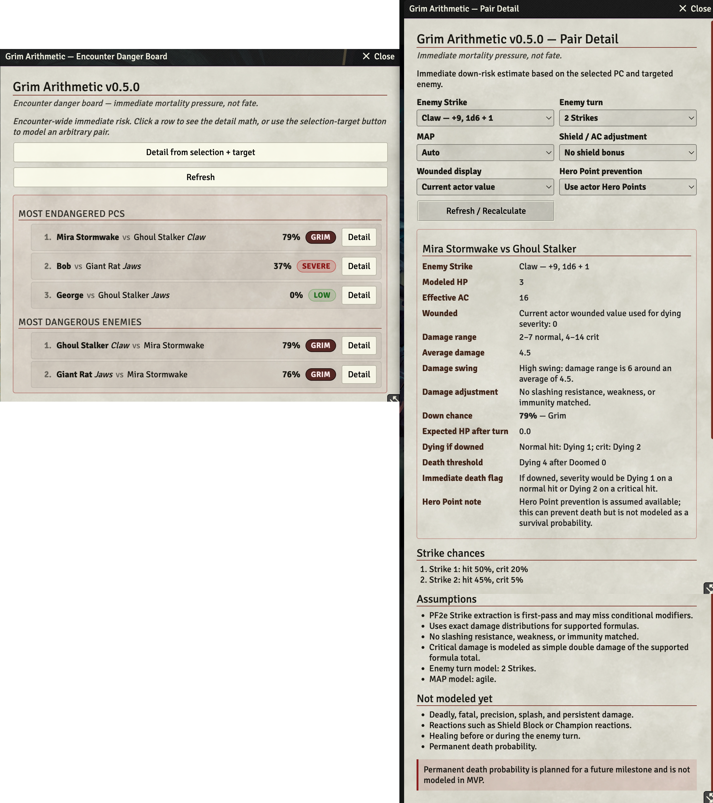
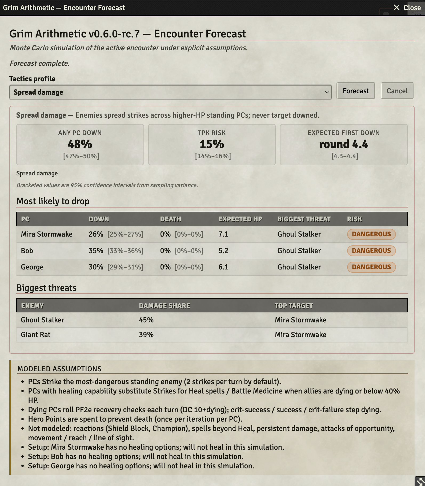

# Grim Arithmetic

*Foundry knows how hard the encounter is. Grim Arithmetic tells you who might not walk away.*

A GM-only Foundry VTT module for **Pathfinder 2e** that surfaces real, immediate down-risk for every PC vs every enemy in the current scene — using exact dice distributions, not vibes.





## What it does

- **Encounter Danger Board** — a sortable table of the most endangered PCs and the most dangerous enemies, with per-pair down chance and a one-click drilldown.
- **Pair Detail panel** — exact dice-distribution math for a chosen PC vs enemy Strike: damage range, average, swinginess, down chance, dying severity, doomed-adjusted death threshold, and Hero Point notes.
- **PF2e-aware extraction** — pulls Strikes, AC, HP, wounded, and doomed straight from the actor.
- **Honest about scope** — explicitly flags what is and isn't modeled (no permanent-death probability, no reactions, no persistent damage — yet).

## Install

**Option 1 — Foundry package directory (easiest):**
Search for **Grim Arithmetic** in Foundry's **Add-on Modules → Install Module** browser, or visit the [listing on foundryvtt.com](https://foundryvtt.com/packages/grim-arithmetic) and click *Install*.

**Option 2 — Manifest URL:**
In Foundry, go to **Add-on Modules → Install Module → Manifest URL** and paste:

```
https://github.com/kyletravis/grim-arithmetic/releases/latest/download/module.json
```

For a specific pinned version, grab the version-specific `module.json` URL from that [GitHub Release](https://github.com/kyletravis/grim-arithmetic/releases).

After installing, enable **Grim Arithmetic** inside your PF2e world via **Game Settings → Manage Modules**.

## How to use

1. Open a PF2e scene with at least one PC token and one hostile NPC token.
2. Open the **Token Controls** toolbar and click the **skull icon**.
3. The **Encounter Danger Board** opens, ranking the riskiest PC/enemy pairings in the scene.
4. Click **Detail** on any row to open the **Pair Detail** panel for that matchup.
5. In Pair Detail, you can switch the enemy Strike, change MAP, toggle Hero Point assumptions, and pick which wounded value drives the math.

The board and detail panel are GM-only and never broadcast to players.

## RC6 Changelog

v0.6.0-rc.6 through v0.5.0 introduced the Monte Carlo Forecast engine and the Danger Board / Pair Detail split:

- **rc.6** — Simplified Forecast UI: removed iteration count and seed inputs, set default tactics to Spread damage.
- **rc.5** — Added 95% confidence intervals to all Forecast proportion metrics.
- **rc.4** — Phase I-A PC survival: healing (Battle Medicine, Heal spell/cantrip), recovery checks, Hero Point death prevention.
- **rc.3** — PC action modeling: PCs now Strike back in the simulation.
- **rc.2** — Lowered default round cap (10 → 5), added pessimism banner for high-lethality warnings.
- **rc.1** — Monte Carlo encounter simulation engine, Forecast panel, Web Worker integration, 5 tactics profiles.
- **v0.5.0** — Encounter Danger Board (main window) + Pair Detail popup, pairwise down-risk, `MAX_PAIRS` guardrail.

## RC7 Changelog

v0.6.0-rc.7 addresses findings from an independent security review:

- **H-1:** Added strict dice formula budgets (max 500 total dice, 100 per term, 50000 outcomes) to prevent CPU exhaustion from malformed actor data.
- **M-1:** Gated debug capture API behind the `debugLogging` setting and GM check to prevent stat-block data leakage in console logs.
- **M-2:** Pinned all dev dependency versions to exact lockfile values for reproducible builds.
- **Low:** Removed source maps from production builds.

## Compatibility

| | |
|---|---|
| Foundry VTT | v13 minimum, smoke-tested on **v14.361** |
| System | Pathfinder 2e (`pf2e`) |
| Current version | see [latest release](https://github.com/kyletravis/grim-arithmetic/releases/latest) |

Starfinder 2e support is on the roadmap.

## Disclaimer

Grim Arithmetic is an independent module and is not affiliated with, endorsed by, or sponsored by Foundry Gaming LLC, Paizo Inc., or the Pathfinder/Starfinder brands.

## More documentation

- [Calculation Guide](./docs/ARITHMETIC.md) — how the math works
- [Full Install Guide](./docs/INSTALL.md) — manual / server-side install
- [Testing Guide](./docs/TESTING.md) — Foundry v13/v14 PF2e smoke tests
- [Product Requirements](./PRD.md) and [Backlog](./BACKLOG.md)
- [Release Workflow](./docs/RELEASE.md)

## Development

```bash
npm install
npm run check     # eslint + vitest + vite build
npm run package   # build the release zip
```
